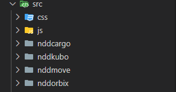
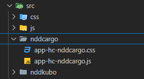
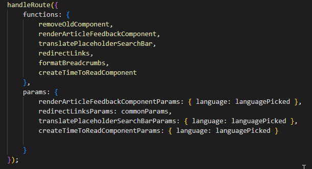
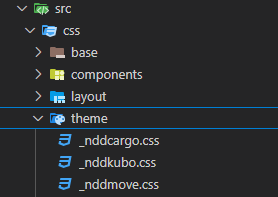

Este guia orienta administradores na personalização do Help Center para integração com o novo layout e funcionalidades.

**Antes de iniciar**

- Certifique-se de instalar [Visual studio code](https://code.visualstudio.com/).
- Certifique-se de instalar o [Node.js](https://nodejs.org/pt).
- Certifique de instalar o Git.
- Certifique-se que o seu usuário do Github tenha permissão no repositório.
- Certifique-se que o Help Center já foi configurado com as novas definições.

## Neste artigo

- [Neste artigo](#neste-artigo)
- [Passo 1: Clonar o repositório do projeto](#passo-1-clonar-o-repositório-do-projeto)
- [Passo 2: Instalar as dependências do projeto](#passo-2-instalar-as-dependências-do-projeto)
- [Passo 3: Estrutura de arquivos](#passo-3-estrutura-de-arquivos)
- [Passo 4: Configuração do JavaScript](#passo-4-configuração-do-javascript)
- [Passo 5: Atualização de rotas](#passo-5-atualização-de-rotas)
- [Passo 6: Traduções](#passo-6-traduções)
  - [Categorias](#categorias)
  - [Links](#links)
  - [Tiles (documentos)](#tiles-documentos)
- [Passo 7: Redirecionamento de links](#passo-7-redirecionamento-de-links)
- [Passo 8: Personalização do Tema CSS](#passo-8-personalização-do-tema-css)
- [Passo 9: Compilação e publicação](#passo-9-compilação-e-publicação)
---

## Passo 1: Clonar o repositório do projeto
Você pode utilizar o [Github desktop](https://docs.github.com/pt/desktop) para realizar todas as ações do Git.

1. Abra um terminal ou prompt de comando.
2. Navegue até o diretório onde deseja clonar o repositório utilizando o comando:
```
cd /caminho/do/diretorio
```
3. Clone o repositório utilizando o comando:
```
git clone https://github.com/confluencendd/confluencendd.github.io.git

```
4. Após a clonagem, entre na pasta do projeto:
```
cd nome-do-repositorio
```

## Passo 2: Instalar as dependências do projeto

O projeto utiliza o gerenciador de pacotes `npm` para gerenciar as dependências. Certifique-se de que o Node.js e o npm estejam instalados:

1. Baixe o Node.js no site oficial: [Node.js](https://nodejs.org/pt).
2. Durante a instalação, o npm será configurado automaticamente.

**Depois que o Node.js estiver instalado:**
1. No terminal, no diretório do projeto clonado, execute o comando abaixo para instalar todas as dependências do projeto:
```
npm install
```
2. Aguarde a conclusão do processo de instalação. Isso criará a pasta node_modules com todas as dependências necessárias.
3. Abra o projeto no Visual Studio Code com o comando:
```
code .
```

## Passo 3: Estrutura de arquivos

1. **Crie a pasta do produto:** No diretório `src`, adicione uma nova pasta com o nome do produto correspondente.



2.  **Crie os arquivos principais:** Na pasta do produto, crie os arquivos:
```
app-hc-ndd[produto].js
app-hc-ndd[produto].css
```



3. **Importe as estilizações no CSS do produto:** Inclua o seguinte conteúdo no arquivo `app-hc-ndd[produto].css`, **ajustando a linha 7 com** o nome do produto.

```CSS
/* --- IMPORTS --- */
/* BASE */
@import url("../css/base/_base.css");
@import url("../css/base/_typography.css");

/* TEMA */
@import url("../css/theme/_nddcargo.css");

/* LAYOUT */
@import url("../css/layout/_banner.css");
@import url("../css/layout/_breadcrumbs.css");
@import url("../css/layout/_code.css");
@import url("../css/layout/_expand.css");
@import url("../css/layout/_header.css");
@import url("../css/layout/_images.css");
@import url("../css/layout/_lists.css");
@import url("../css/layout/_main-content.css");
@import url("../css/layout/_panels.css");
@import url("../css/layout/_tiles.css");

/* COMPONENTS */
@import url("../css/components/_header-bar.css");
@import url("../css/components/_layout.css");
@import url("../css/components/_article-feedback.css");
/* --- IMPORTS --- */
```
4. Salve o arquivo

---

## Passo 4: Configuração do JavaScript

1. **Importe as funções no arquivo JS do produto:** Adicione o seguinte trecho ao arquivo `app-hc-ndd[produto].js` para carregar as funções úteis e configurar as rotinas do Help Center.

```JS
// Importação das funções úteis
import { getCurrentLanguage } from '../js/utils/getLanguage';
import { getCurrentProduct } from '../js/utils/getProduct';
import { redirectLinks } from '../js/utils/redirect';
import { handleRoute } from '../js/utils/route';
import { removeOldComponent } from '../js/utils/removeOldComponent';

// Funções de tradução
import { translateTiles } from '../js/components/translation/tiles';
import { translateCategories } from '../js/components/translation/categories';
import { translateHeaderLinks } from '../js/components/translation/headerLinks';
import { translatePlaceholderSearchBar } from '../js/utils/placeholder';
import { formatBreadcrumbs } from '../js/utils/breadcrumbs';
import { createTimeToReadComponent } from '../js/components/header-bar/time-to-read';
import { renderArticleFeedbackComponent } from '../js/components/article-feedback/article-feedback';

// Parâmetros comuns
const languagePicked = getCurrentLanguage();
const currentProduct = getCurrentProduct();
const commonParams = { product: currentProduct, language: languagePicked };

// Configuração de rotas e funções
handleRoute({
    functions: {
        removeOldComponent,
        renderArticleFeedbackComponent,
        translateTiles,
        translateCategories,
        translateHeaderLinks,
        translatePlaceholderSearchBar,
        redirectLinks,
        formatBreadcrumbs,
        createTimeToReadComponent
    },
    params: {
        renderArticleFeedbackComponentParams: { language: languagePicked },
        translateTilesParams: commonParams,
        translateCategoriesParams: commonParams,
        translateHeaderLinksParams: commonParams,
        redirectLinksParams: commonParams,
        translatePlaceholderSearchBarParams: { language: languagePicked },
        createTimeToReadComponentParams: { language: languagePicked }
    }
});
```

**ATENÇÃO**

As funções `translateTiles`, `translateCategories` e `translateHeaderLinks` servem para realizar a tradução do Help Center para outros idiomas, ou seja, se não for necessária a tradução basta remover o seu uso.



---

## Passo 5: Atualização de rotas

1. **Configure as URLs do novo Help Center:** Edite o arquivo `src/js/utils/route.js`, adicionando a nova URL:

```JS
const baseUrls = [
    'https://helpcenter-testes.ndd.tech',
    'https://helpcenter-nddorbix.ndd.tech',
    'https://helpcenter-nddprint.ndd.tech',
    'https://helpcenter-kubo.ndd.tech',
    'https://helpcenter-nddmove.ndd.tech',
    'NOVA URL'
];
```
2. Se necessário, adicione novos idiomas às rotas:
```JS
const languages = ['', '?l=pt', '?l=en', '?l=es', '?l=it', '?l=NOVOIDIOMA'];
```

---

## Passo 6: Traduções
Este tópico serve apenas para o Help Center que possuí mais de um idioma.

### Categorias
Na pasta `src/js/components/resources` inclua ou atualize as traduções em `categoriesResources.json`:

```json
"nddprint": {
    "pt": {
        "Preciso de ajuda": { "text": "Preciso de ajuda" }
    },
    "en": {
        "Preciso de ajuda": { "text": "I need some help" }
    },
    "es": {
        "Preciso de ajuda": { "text": "Busco ayuda" }
    }
}
```

### Links
Na pasta `src/js/components/resources` inclua ou atualize as traduções em `headerLinksResources.json`:

```json
"nddprint": {
    "pt": {
        "Suporte": { "text": "Suporte" }
    },
    "en": {
        "Suporte": { "text": "Support" }
    },
    "es": {
        "Suporte": { "text": "Soporte" }
    }
}
```

### Tiles (documentos)
Na pasta `src/js/components/resources` inclua ou atualize as traduções em `tilesResources.json`:

- **headline** - Título do documento
- **description** - Descrição do documento

```json
"nddprint": {
    "pt": {
        "Comece aqui": {
            "headline": "Comece aqui",
            "description": "Entenda o conceito dos módulos, funcionalidades e cenários do NDD Print."
        }
    },
    "en": {
        "Comece aqui": {
            "headline": "Getting started",
            "description": "Understand the concept of NDD Print modules, functionalities and scenarios."
        }
    },
    "es": {
        "Comece aqui": {
            "headline": "Empieza aqui",
            "description": "Comprender el principio de los módulos, funcionalidades y escenarios de NDD Print."
        }
    }
}
```
---

## Passo 7: Redirecionamento de links
Este tópico serve para que alguns documentos sejam redirecionados para outras páginas. Por exemplo, um documento que se chama **Falar com o suporte** pode ser redirecionado para o **portal de abertura de chamados**.

```json
"https://helpcenter-kubo.ndd.tech/pt/falar-com-suporte/Current/": "https://suporte.ndd.tech/"
```
Na pasta `src/js/utils/resources` inclua ou atualize os links em `linksDocumentsMapResources.json`:

```json
"kubo": {
    "pt": {
      "https://helpcenter-kubo.ndd.tech/pt/falar-com-suporte/Current/": "https://suporte.ndd.tech/"
    },
    "en": {
      "https://helpcenter-kubo.ndd.tech/en/falar-com-suporte/Current/": "https://suporte.ndd.tech/"
    },
    "es": {
      "https://helpcenter-kubo.ndd.tech/es/falar-com-suporte/Current/": "https://suporte.ndd.tech/"
    }
  }
```

**NOTA:**

Se o Help Center possuir apenas o idioma português, adicione apenas o redirecionamento para este idioma.
```json
"kubo": {
    "pt": {
      "https://helpcenter-kubo.ndd.tech/pt/falar-com-suporte/Current/": "https://suporte.ndd.tech/"
    }
  }
```

---

## Passo 8: Personalização do Tema CSS
Para a mudança visual do Help Center, é necessário criar o tema.

1. Crie um tema CSS para o produto na pasta `src/css/theme`: Nomeie o arquivo como `_produto.css`.



2. Abra o arquivo e insira o conteúdo:

```CSS
:root {
  --ndd-cargo-primary-color: #cc0000;
  --ndd-cargo-secondary-color: #071f36;
  --ndd-cargo-third-color: #224180;
  --ndd-cargo-link-color: rgba(0,0,0,0.2);
  --ndd-cargo-link-hover-color: rgba(0,0,0,0.4);
  --ndd-cargo-link-highlight-color: var(--ndd-cargo-primary-color);
  --ndd-cargo-link-highlight-hover-color: #b80000;
}

/* --- LINKS --- */
li.render-links--link {
  background-color: var(--ndd-cargo-link-color);
}

li.render-links--link:hover {
  background-color: var(--ndd-cargo-link-hover-color);
  -webkit-transition: background-color 0.3s cubic-bezier(0.165, 0.84, 0.44, 1);
  -ms-transition: background-color 0.3s cubic-bezier(0.165, 0.84, 0.44, 1);
  transition: background-color 0.3s cubic-bezier(0.165, 0.84, 0.44, 1);
}

/* --- LINK DESTACADO --- 
  li.render-links--link:nth-child(4) {
    background-color: var(--ndd-cargo-link-highlight-color);
  }
  li.render-links--link:nth-child(4):hover {
    background-color: var(--ndd-cargo-link-highlight-hover-color);
    -webkit-transition: background-color 0.3s cubic-bezier(0.165, 0.84, 0.44, 1);
    -ms-transition: background-color 0.3s cubic-bezier(0.165, 0.84, 0.44, 1);
    transition: background-color 0.3s cubic-bezier(0.165, 0.84, 0.44, 1);
  }*/

/* ---------------------- HEADER ---------------------- */

/* ---------------------- TILES ---------------------- */

  /* --- TILES HELP CATEGORY --- */
  
  /* @media (min-width: 768px) {
    ul[aria-labelledby="Precisodeajuda"] > li.tile {
      grid-column: span 3 / span 3;
    }
  } */
  
  ul[aria-labelledby="Precisodeajuda"] > li {
    align-items: center;
    color: var(--ndd-text-color);
  }
  
  ul[aria-labelledby="Precisodeajuda"] h3.tile__headline {
    color: var(--ndd-text-color);
  }
  
  /* --- TILES HELP CATEGORY --- */

/* ---------------------- TILES ---------------------- */

/* ---------------------- CONTENT ---------------------- */

/*strong > span[data-colorid] {
    color: var(--ndd-cargo-primary-color);
  }*/

/* ---------------------- CONTENT ---------------------- */
```

3. Altere as cores e o nome do produto:
```CSS
:root {
  --ndd-[produto]-primary-color - Cor primária do produto
  --ndd-[produto]-secondary-color- Cor secundária do produto
  --ndd-[produto]-third-color - Cor terciária do produto
  --ndd-[produto]-link-color - Cor dos links
  --ndd-[produto]-link-hover-color - Cor quando o mouse é passado sobre o links
  --ndd-[produto]-link-highlight-color: var(--ndd-[produto]-primary-color) - Cor do link de destaque
  --ndd-[produto]-link-highlight-hover-color - Cor quando o mouse é passado sobre o link de destaque
}
```

**DICA:**

A cor --ndd-[produto]-link-highlight-hover-color pode ser obtida através da sombra do personagem do Banner:


---

## Passo 9: Compilação e publicação
1. Adicione os scripts de build no arquivo `package.json` alterando o nome do produto:
```JSON
"nddmove-build": "parcel build src/nddmove/app-hc-nddmove.js src/nddmove/app-hc-nddmove.css --dist-dir public/ --no-source-maps --no-cache",
"nddmove-dev": "parcel watch src/nddmove/app-hc-nddmove.js src/nddmove/app-hc-nddmove.css --dist-dir dev/nddmove"
```

2. Compile os arquivos finais executando o comando no terminal do VS Sudio.
```
npm run ndd[produto]-build
```
3. Realize o commit e push das alterações para o repositório Git através dos comandos:
```
git add .
git commit -m "Atualização do script de personalização para o novo layout do Help Center"
git push origin master
```

**DICA:**

Você pode utilizar o [Github desktop](https://docs.github.com/pt/desktop) para realizar todas as ações do Git.

**IMPORTANTE:**

Os arquivos **CSS** e **Javascript** estão disponíveis no link, e podem demorar alguns minutos para ficarem online.
- https://confluencendd.github.io/public/app-hc-[PRODUTO].css
- https://confluencendd.github.io/public/app-hc-[PRODUTO].js